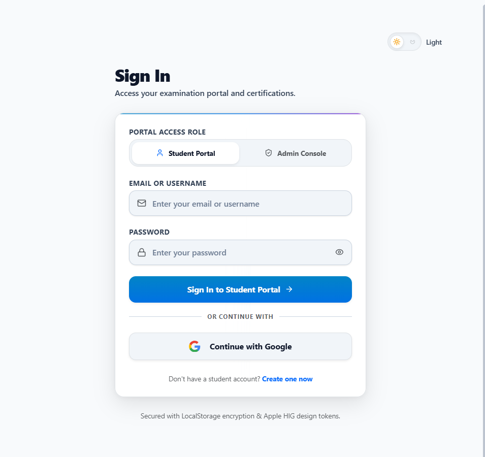
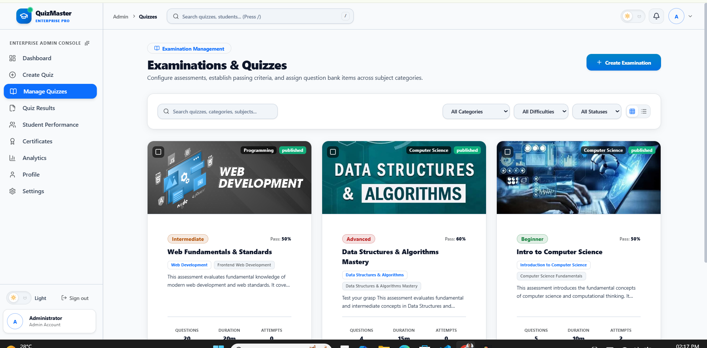
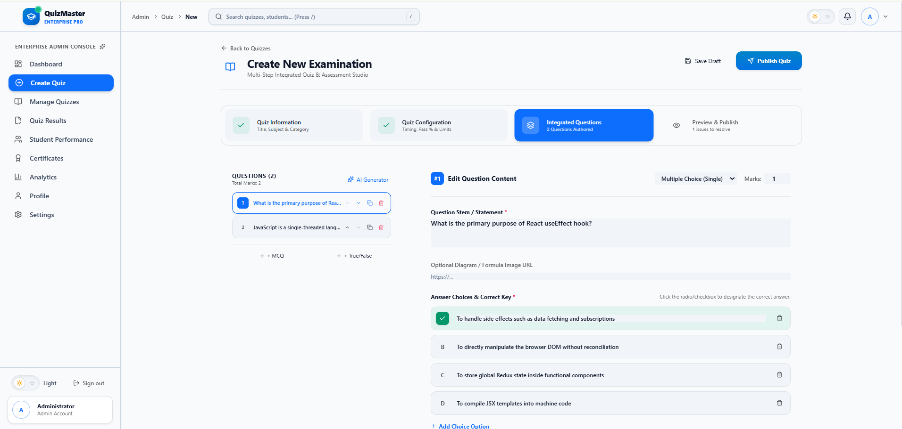
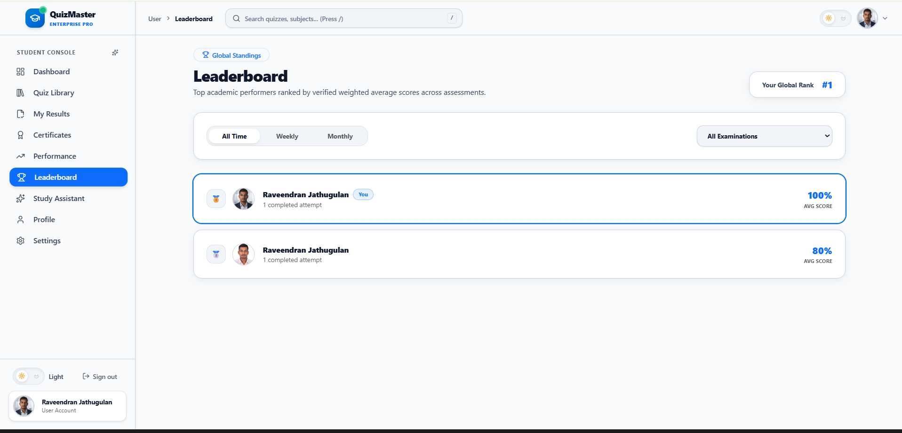
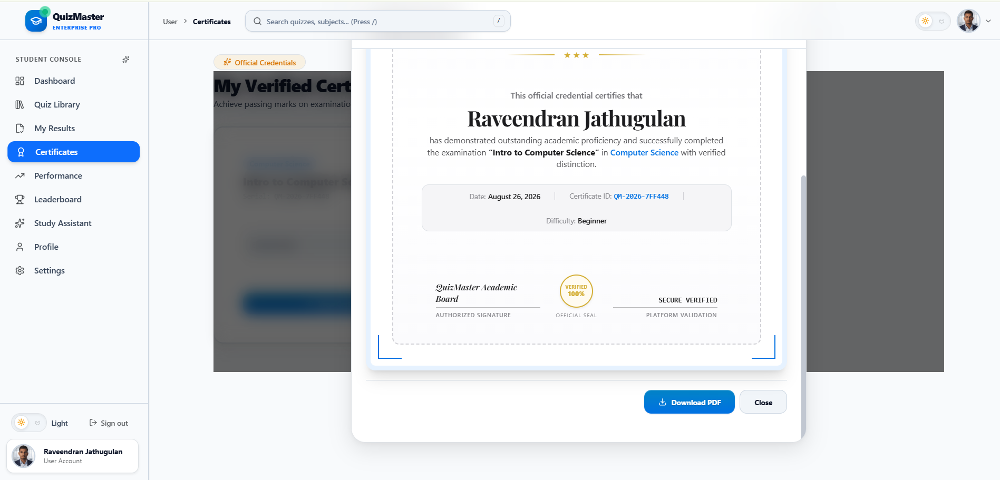
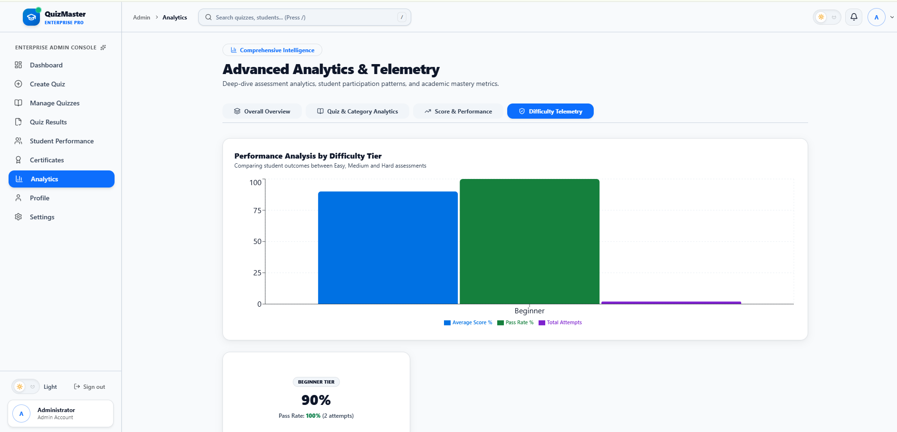

# 🎓⚡ QuizMaster — Intelligent Examination & Assessment Platform

<div align="center">

### 🚀 Enterprise-Grade Online Examination, Quiz & Assessment Platform

**QuizMaster** is a modern, secure, AI-powered examination management platform designed for universities, schools, training institutes, educators, certification providers, and professional learning platforms.

It combines **online examinations, intelligent quiz generation, real-time analytics, resilient exam sessions, server-authoritative scoring, question-bank management, student performance intelligence, digital certificates, leaderboards, and Google Gemini AI** into one unified platform.

<br/>

[](https://react.dev/)
[](https://vitejs.dev/)
[](https://nodejs.org/)
[](https://expressjs.com/)
[](https://www.mongodb.com/)
[](https://ai.google.dev/)
[](https://tailwindcss.com/)
[](LICENSE)

<br/>

**🔐 Secure • 🤖 AI-Powered • ⚡ Resilient • 📊 Analytics-Driven • 📜 Certificate-Ready**

</div>

---

# 📸 Screenshots

All application screenshots are stored in the [`screenshots/`](./screenshots/) directory.

## 🏠 Landing Page


---

## 🔐 Authentication

### Login



### Registration


---

## 👑 Admin Dashboard


The administrative dashboard provides:

* Total students
* Total quizzes
* Published examinations
* Total attempts
* Average score
* Pass/fail statistics
* Certificate statistics
* Registration trends
* Quiz participation
* Performance analytics
* Recent activities
* System health
* Quick actions

---

## 📝 Quiz Management



Administrators can:

* Create quizzes
* Edit quizzes
* Duplicate quizzes
* Publish/unpublish quizzes
* Archive quizzes
* Configure time limits
* Configure pass percentage
* Configure attempts
* Configure negative marking
* Configure question randomization
* Configure answer randomization
* Configure access permissions
* Configure question pools
* Preview examinations

---

## 🧠 Question Bank



Centralized question management supporting:

* Multiple Choice
* Multi-Select
* True/False
* Short Answer
* Difficulty levels
* Categories
* Tags
* Explanations
* Marks
* Negative marks
* Question status
* Bulk import
* Duplicate detection
* Question preview
* Question versioning

---

## 🤖 AI Quiz Generator


Generate complete examinations using natural-language instructions.

Example:

```text
Generate a 30-question Data Structures examination
for undergraduate students.

Difficulty:
40% Easy
40% Medium
20% Hard

Question Types:
MCQ + True/False

Include:
- Correct answers
- Explanations
- Marks
- Topic classification
```

---

## 🎯 Student Dashboard


Students can view:

* Quiz recommendations
* Upcoming examinations
* Completed quizzes
* Average score
* Pass rate
* Certificates
* Leaderboard rank
* Weak topics
* Strong topics
* Recent activity
* Learning progress

---

## ⏱️ Examination Engine


The examination engine provides:

* Live countdown timer
* Question navigator
* Previous/Next navigation
* Mark for review
* Answer status
* Auto-save
* Network recovery
* Auto-submit
* Full-screen examination mode
* Attempt protection
* Server-side session synchronization

---

## 📊 Examination Results


Students receive:

* Score
* Percentage
* Grade
* Pass/fail status
* Correct answers
* Incorrect answers
* Unanswered questions
* Time spent
* Question-wise performance
* Topic-wise performance
* Explanations
* Improvement recommendations

---

## 🏆 Leaderboard



Leaderboard scopes:

* Global
* Weekly
* Monthly
* Quiz-specific
* Category-specific
* Student-group-specific

---

## 📜 Digital Certificate



Certificates include:

* Candidate name
* Course/quiz title
* Score
* Completion date
* Certificate ID
* Verification URL
* QR code
* Organization branding
* Digital signature
* Custom certificate template

---

## 🔎 Certificate Verification


Anyone can verify a certificate using its unique verification code or QR code.

Example:

```text
https://your-domain.com/verify/QM-8F4A9C21
```

---

## 📈 Advanced Analytics



Analytics include:

* Student registration trends
* Quiz participation
* Pass/fail distribution
* Average scores
* Category performance
* Difficulty performance
* Question accuracy
* Completion rates
* Attempt trends
* Certificate issuance
* Leaderboard analytics

---

# 📁 Project Structure

```text
QuizMaster/
│
├── backend/
│   ├── src/
│   ├── tests/
│   ├── docs/
│   ├── .env.example
│   └── package.json
│
├── frontend/
│   ├── src/
│   ├── public/
│   ├── .env.example
│   └── package.json
│
├── screenshots/
│   ├── admin-dashboard.png
│   ├── ai-generator.png
│   ├── analytics-dashboard.png
│   ├── certificate.png
│   ├── certificate-verification.png
│   ├── exam-interface.png
│   ├── landing-page.png
│   ├── leaderboard.png
│   ├── login.png
│   ├── question-bank.png
│   ├── quiz-management.png
│   ├── quizmaster-banner.png
│   ├── register.png
│   ├── results-dashboard.png
│   └── student-dashboard.png
│
├── postman/
├── README.md
├── TECHNICAL_REPORT.md
└── LICENSE
```

---

# 🛠️ Technology Stack

| Layer             | Technology        |
| ----------------- | ----------------- |
| Frontend          | React 19          |
| Build Tool        | Vite 8            |
| Styling           | Tailwind CSS 3.4  |
| Backend           | Node.js 20        |
| API               | Express.js        |
| Database          | MongoDB Atlas     |
| ODM               | Mongoose          |
| Authentication    | JWT               |
| Password Security | bcrypt            |
| AI                | Google Gemini     |
| Charts            | Recharts          |
| Animation         | Framer Motion     |
| Security          | Helmet            |
| Validation        | express-validator |

---

# 🌟 Core Features

### 👨‍🎓 Student

* Personalized dashboard
* Quiz library
* Online examinations
* Real-time timer
* Auto-save
* Exam recovery
* Results analysis
* Certificates
* Leaderboards
* Achievements
* AI study assistant

### 👑 Administrator

* Executive dashboard
* Quiz management
* Question bank
* AI quiz generation
* Student management
* Group management
* Analytics
* Certificate management
* Audit logging
* System monitoring

### 🤖 AI

* AI quiz generation
* Question generation
* Distractor generation
* Explanation generation
* AI study assistant
* Curriculum generation

### 🔐 Security

* JWT authentication
* Role-based access control
* Server-authoritative scoring
* Immutable exam snapshots
* Secure randomization
* Attempt protection
* Rate limiting
* Request validation
* Audit logging

---

# 🚀 Getting Started

## Backend

```bash
cd backend
npm install
npm run dev
```

## Frontend

```bash
cd frontend
npm install
npm run dev
```

---

# 🔐 Environment Variables

### Backend

```env
PORT=5000
NODE_ENV=development

MONGODB_URI=your_mongodb_connection_string

JWT_SECRET=your_secure_jwt_secret

CLIENT_URL=http://localhost:5173

GEMINI_API_KEY=your_gemini_api_key
```

### Frontend

```env
VITE_API_BASE_URL=http://localhost:5000/api
```

> Never commit real API keys, passwords, JWT secrets, or MongoDB credentials to GitHub.

---

# 🧮 Examination Flow

```text
Student
   ↓
Select Quiz
   ↓
Eligibility Validation
   ↓
Exam Snapshot
   ↓
Secure Exam Session
   ↓
Answer Questions
   ↓
Auto-Save
   ↓
Submit / Auto-Submit
   ↓
Server Validation
   ↓
Server-Side Scoring
   ↓
Result
   ↓
Certificate Eligibility
```

---

# 📊 Analytics

QuizMaster provides analytics for:

* Student performance
* Quiz participation
* Pass/fail rates
* Average scores
* Question accuracy
* Difficulty analysis
* Category performance
* Completion rates
* Certificate issuance
* Leaderboards

---

# 📜 Certificate System

The certificate system supports:

* Unique certificate IDs
* QR codes
* Verification URLs
* Digital signatures
* Custom templates
* Organization branding
* Certificate revocation
* Public verification

---

# 🗺️ Roadmap

* [x] Authentication
* [x] Admin dashboard
* [x] Student dashboard
* [x] Quiz management
* [x] Question bank
* [x] Examination engine
* [x] Server-side scoring
* [x] Google Gemini integration
* [x] Analytics
* [x] Leaderboard
* [x] Digital certificates
* [ ] Multi-tenant architecture
* [ ] SSO
* [ ] Advanced adaptive assessments
* [ ] Institution management

---

# 🤝 Contributing

```bash
git clone https://github.com/Jathugulan/quizmaster-pro-mern.git

cd quizmaster-pro-mern

git checkout -b feature/new-feature

git add .

git commit -m "feat: add new feature"

git push origin feature/new-feature
```

Then create a Pull Request.

---

# 📄 License

This project is licensed under the **MIT License**.

See [`LICENSE`](./LICENSE) for details.

---

# 👨‍💻 Author

<div align="center">

### 🎓 QuizMaster

**Intelligent Examination & Assessment Platform**

Built with ❤️ using:

**React • Node.js • Express • MongoDB • Google Gemini AI**

</div>

---

# ⭐ Support

If you find QuizMaster useful:

* ⭐ Star the repository
* 🍴 Fork the project
* 🐛 Report bugs
* 💡 Suggest features
* 🤝 Submit pull requests

---

<div align="center">

### 🚀 QuizMaster

**Secure • Intelligent • Resilient • Scalable • Verifiable**

</div>
